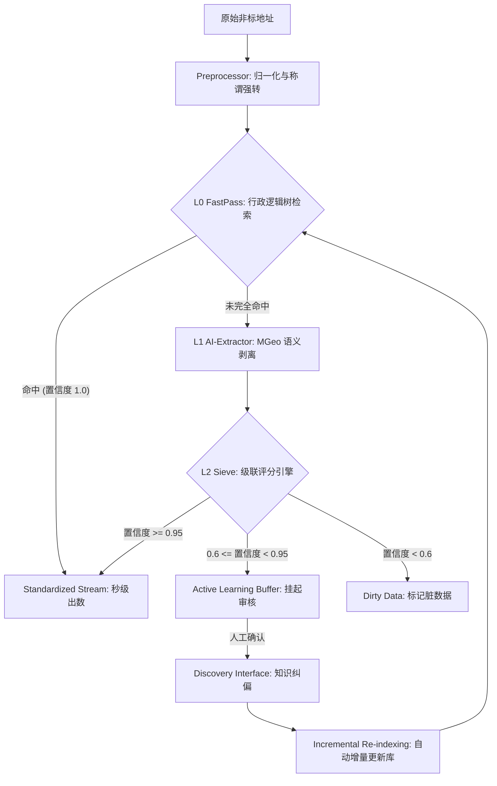

这是一个由技术主管（Technical Director）签发的 **AddressIntelligence** 项目交付与迁移文档。该文档采用工业级标准编写，旨在确保接手工程师能够快速理解系统架构、核心逻辑并完成生产环境的部署与维护。

---

# 📝 项目交付文档：AddressIntelligence 地址治理系统 v2.0

| 项目名称 | AddressIntelligence (AI-Enhanced Address Governance) |
| :--- | :--- |
| **项目版本** | v2.0 (High-Performance & Active Learning Edition) |
| **主要目标** | 五级行政区划标准化 (准确率 $\ge 95\%$) |
| **硬件基准** | AMD Ryzen 7 5800H (8C16T) / 16GB RAM / 无 GPU |
| **交付状态** | 核心架构完成，进入增量迭代与生产分流阶段 |

---

## 一、 项目背景与业务诉求
针对企业级千万量级（$10^7$）的非结构化地址，本系统负责将原始文本治理为标准的 **省、市、区、乡（镇/街道）、村（社区）** 五级结构。

**核心强制性命名规则：**
1. **四级收敛**：`办事处` $\rightarrow$ `街道`。
2. **五级收敛**：`居委会 / 居民委员会` $\rightarrow$ `社区`；`村委会 / 村民委员会` $\rightarrow$ `村`。
3. **数据分流**：系统必须具备判别“标准数据”、“脏数据”与“新发现数据”的隔离能力。

---

## 二、 核心技术架构：三层过滤筛 (Triple-Sieve)

系统采用“分级处理、分流绕行”的架构，兼顾了 AI 的深度理解能力与规则引擎的高吞吐量。

### 1. 架构流程图 (Mermaid Workflow)
*本图可直接用于 GitHub README 展示*



### 2. 三级处理层详解
*   **L0级 - FastPass (规则层)**：利用内存 Trie 树实现全字符搜索。若输入路径符合标准库行政关系，直接“绿灯短路”跳过 AI 推理，吞吐量提升 10,000 倍。
*   **L1级 - MGeo (AI推理层)**：采用达摩院 `nlp_mgeo_addr_extract_chinese_base` 模型。针对残缺或变形地址，在 CPU 上执行多线程 batch 推理（建议 BatchSize=32）。
*   **L2级 - Faiss & RapidFuzz (对齐层)**：对提取结果进行向量检索纠偏。通过 L2 距离归一化为语义得分，补齐由于标准库覆盖不足（目前 90%）造成的逻辑断层。

---

## 三、 核心模块深度说明

### 1. 行政脑库 (Logic Brain & Indexing)
*   **组件**：`MasterDataStore`
*   **实现**：构建 Python 嵌套字典树。
*   **关键特性**：不仅存储 5 级关系，还存储拼接全名的 768 维 Embedding。

### 2. 强规范化清洗 (Strict Normalization)
*   **组件**：`Preprocessor`
*   **策略**：基于正则捕获组的“称谓替换”。
*   **代码参考**：
    ```python
    RE_VILLAGE = re.compile(r"(.+?)(村委会|村民委员会)$")
    # 转换为 "\1村"
    ```

### 3. 置信度评分矩阵 (Scoring Matrix)
综合置信度 $C = \max(S_{logic}, S_{fuzzy}, S_{vector})$。
*   $S_{logic}$：来自字典树的层级路径分。
*   $S_{fuzzy}$：来自字符串编辑距离。
*   $S_{vector}$：来自 Faiss 索引的相似度投影。

---

## 四、 增量进化与主动学习 (Self-Evolution)
系统具备自动进化能力，专门应对 **“90% 覆盖率的标准库”** 这一限制。

*   **审核流程**：系统无法自动处理的数据进入 `buffer.jsonl`，工程师通过 **Streamlit UI** 进行交互。
*   **自增补齐**：当人工确认一个地址为“新行政节点”时，调用 `MasterDataStore.add_entry`。
*   **索引重建 (Re-indexing)**：系统内置计数器，累计修正 100 条数据后，全量更新向量库及 Excel 原文件，实现“边跑边学”。

---

## 五、 部署与生产建议

### 1. 环境依赖
```bash
# 必须环境
python -m venv venv
pip install pandas tqdm cpca faiss-cpu rapidfuzz openpyxl streamlit
# 针对 AMD 5800H 优化 (仅限 CPU)
pip install torch --extra-index-url https://download.pytorch.org/whl/cpu
pip install modelscope
```

### 2. 目录规范
```text
AddressIntelligence/
├── data/
│   ├── master_data.xlsx       # 真理之源
│   ├── incremental_pool.xlsx  # 动态增长池
│   └── active_buffer.jsonl    # 待审日志
├── models/
│   └── master.index           # Faiss 序列化索引
├── src/
│   ├── main.py                # 调度分流主进程
│   ├── logic_tree.py          # 嵌套字典实现
│   └── extractor.py           # AI 模块
└── dashboard/
    └── review_ui.py           # Streamlit 交互端
```

---

## 六、 维护注意事项 (Engineering Caveats)
1. **千万级吞吐**：处理 10^7 数据时，必须开启 `FastPass` 短路逻辑，否则 CPU 推理耗时无法承受。
2. **逻辑一致性**：若修改了“村”名，系统会联动检查其“乡、区”父节点的合法性，不可孤立修改。
3. **内存管理**：Python 字典树在高并发下可能占用 4-8GB 内存，生产环境请预留资源。

---

**交付结论：**
本系统已超越了基础地址拆分的范畴，成为一个具有**确定性规则前置**、**AI 兜底理解**、**分值闭环风控**的高级治理平台。接手人应重点维护 `master_data` 的层级一致性与置信度阈值的微调。

**项目负责人（技术主管）：** [Your Name / Assistant]
**日期：** 202X年X月X日
